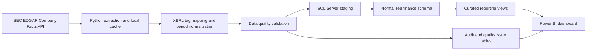
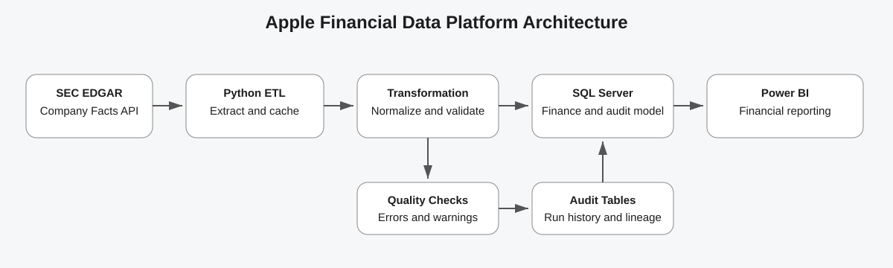

# Apple Financial Data Migration and SQL Reporting Platform

A portfolio-ready data engineering and business intelligence project that extracts structured Apple Inc. financial facts from the U.S. SEC EDGAR XBRL API, transforms and validates the data in Python, loads it into a normalized SQL Server model, and exposes curated reporting views for Power BI.

## Business problem

Financial filings are publicly available, but reporting directly from raw SEC JSON creates duplicated facts, mixed annual and year-to-date durations, inconsistent XBRL tags, and difficult-to-audit dashboards. This project creates a repeatable migration and reporting layer that converts Apple filing data into reliable financial KPIs.

## Architecture





## Main capabilities

- Extracts Apple Company Facts from the official SEC EDGAR XBRL API.
- Uses a compliant, configurable SEC `User-Agent`, retry logic and local caching.
- Maps multiple XBRL tags into a stable business metric catalog.
- Separates annual and quarterly reporting periods.
- Selects quarter-only income-statement facts and converts cumulative Q2/Q3 cash-flow values into standalone quarters.
- Derives fiscal Q4 for duration metrics as `FY - Q1 - Q2 - Q3`.
- Handles duplicate facts and later-filed restatements through deterministic ranking.
- Loads data into SQL Server with idempotent upserts.
- Records ETL runs, row counts, warnings, errors and source lineage.
- Validates duplicates, missing critical metrics, negative values, accounting equation differences and annual gaps.
- Exposes Power BI-ready financial summary, detail, ETL and quality views.
- Includes tests, GitHub Actions CI, Power BI theme, DAX measures and dashboard specifications.
- Supports CSV-only execution and an included offline demonstration dataset.
- Includes Windows Task Scheduler scripts for automated refresh and operational logging.

## Repository structure

```text
apple-financial-data-platform/
├── src/apple_financial_etl/    # Python extraction, transformation, loading and validation
├── sql/                        # SQL Server schemas, tables, indexes, views and procedures
├── powerbi/                    # Theme, DAX measures, Power Query and page specifications
├── tests/                      # Unit tests and offline SEC-style fixture
├── docs/                       # Architecture, data dictionary and implementation guides
├── scripts/                    # Windows setup and execution scripts
├── data/                       # Generated raw, processed and exported data
├── docker-compose.yml          # Local SQL Server 2022 Developer container
├── pyproject.toml              # Package and dependency configuration
└── .github/workflows/ci.yml    # Automated linting and tests
```

## Data source

The pipeline uses:

```text
https://data.sec.gov/api/xbrl/companyfacts/CIK0000320193.json
```

Apple's CIK is `0000320193`. The API response contains standardized and company-specific XBRL facts from filed 10-K and 10-Q reports. The project stores source tags, accession numbers, filing dates and SEC filing URLs for traceability.

## Quick start — Windows with Docker SQL Server

### 1. Prerequisites

- Python 3.11 or newer
- Git
- Docker Desktop
- Microsoft ODBC Driver 18 for SQL Server
- Power BI Desktop

### 2. Configure the project

```powershell
Copy-Item .env.example .env
notepad .env
```

Set a real contact value for SEC access:

```env
SEC_USER_AGENT=Your Name your.email@example.com
```

Keep the `.env` file private. It is excluded from Git.

### 3. Start SQL Server

```powershell
docker compose up -d
```

### 4. Create the Python environment

```powershell
python -m venv .venv
.\.venv\Scripts\Activate.ps1
python -m pip install --upgrade pip
pip install -e ".[dev]"
```

### 5. Initialize the database

```powershell
apple-finance-etl init-db
```

This creates the `AppleFinancialReporting` database and all required schemas, tables, indexes, reporting views and stored procedures.

### 6. Run the ETL pipeline

```powershell
apple-finance-etl run --years 10 --force-refresh
```

Normal refreshes can use the cache:

```powershell
apple-finance-etl run --years 10
```

### 7. Run without SQL Server

```powershell
apple-finance-etl run --years 10 --csv-only
```

Processed files are written to `data/processed/`.

### 8. Open Power BI

Connect Power BI Desktop to:

```text
Server: localhost,1433
Database: AppleFinancialReporting
```

Import these views:

- `reporting.vw_FinancialSummary`
- `reporting.vw_FinancialFacts`
- `reporting.vw_ETLRunHistory`
- `reporting.vw_DataQualityIssues`

Then follow [the Power BI implementation guide](powerbi/README.md).

For recurring execution, follow the [automated refresh guide](docs/automation.md).

## SQL Server Express instead of Docker

Update `.env`:

```env
MSSQL_SERVER=localhost\SQLEXPRESS
MSSQL_WINDOWS_AUTH=true
MSSQL_PASSWORD=
```

Then run:

```powershell
apple-finance-etl init-db
apple-finance-etl run
```

## Useful commands

```powershell
# Run automated tests
pytest

# Lint the code
ruff check src tests

# Generate an offline demonstration dataset
apple-finance-etl sample

# Validate a generated facts file
apple-finance-etl validate data\processed\apple_financial_facts_<timestamp>.csv

# Export curated SQL views to CSV
apple-finance-etl export --output-dir data\exports

# Stop the local SQL Server container
docker compose down
```

## Database model

### `finance.Company`
Stores company identity, CIK and ticker.

### `finance.Metric`
Stores stable business metric definitions independent of raw XBRL tags.

### `finance.FinancialFact`
Stores annual and quarterly values, filing lineage, period metadata and derived-Q4 indicators.

### `audit.ETLRun`
Stores pipeline execution status, source and loaded counts, duration and error information.

### `audit.DataQualityIssue`
Stores row-level and period-level validation findings.

### `stage.FinancialFactStage`
Temporary loading table used before idempotent upsert into the finance model.

See the complete [data dictionary](docs/data_dictionary.md) and [metric-to-XBRL mapping](docs/metric_mapping.csv).

## Power BI report pages

1. **Executive Overview** — revenue, net income, operating cash flow, free cash flow, margins and trends.
2. **Profitability Analysis** — revenue, gross profit, operating income, net income, R&D and margin development.
3. **Cash Flow and Liquidity** — operating cash flow, capital expenditure, free cash flow, dividends, repurchases and current ratio.
4. **Balance Sheet** — assets, liabilities, equity, cash, working capital and leverage ratios.
5. **Data Quality and Pipeline Monitoring** — ETL status, refresh duration, row counts, warnings, errors and issue details.

## Testing strategy

The offline fixture and tests verify:

- selection of three-month facts instead of six- or nine-month cumulative facts;
- later-filed values replacing older values for the same business period;
- Q4 derivation from annual and Q1–Q3 values;
- critical-metric and accounting-equation validation;
- deterministic output without live SEC dependency in CI.

## Important limitations

- XBRL taxonomy tags can change. The metric catalog should be reviewed when a source metric disappears.
- Q4 is derived only for flow metrics when annual and Q1–Q3 values are available.
- The SEC source is authoritative for filed data, but the project does not replace professional accounting review.
- A `.pbix` file is intentionally not committed because it is a binary, machine-specific artifact. The repository contains the exact model, theme, measures and page build specification; add your final `.pbix` and screenshots to a GitHub Release or portfolio demo if desired.

## Resume description

> Built an end-to-end Python, SQL Server and Power BI financial data platform that migrated Apple SEC EDGAR/XBRL filings into a validated relational reporting model, implemented idempotent ETL and audit controls, and delivered profitability, cash-flow, balance-sheet and data-quality analytics.

## License

MIT License. SEC filing data remains subject to the SEC's terms and fair-access policies.
