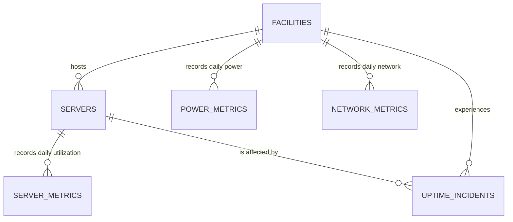

# Step 4 — Canonical Data Model and Contract

## 1. What

Step 4 formalizes the six-table canonical data model as an executable contract. The contract defines table purpose, row grain, columns, data types, nullability, units, allowed values, ranges, primary keys, foreign keys, recommended indexes, module dependencies, and external-data requirements.

The current canonical schema is retained unchanged. No columns were added to or removed from the six datasets, and no SQLite database was created.

## 2. Why

The canonical model is the boundary between variable source data and stable analytics consumers. Power BI, SQLite, RAG schema knowledge, SQL validation, and future adapters must agree on what each row and field means. An executable contract prevents documentation and implementation from drifting apart.

## 3. Concepts

- **Canonical model:** the stable internal representation accepted by every downstream component.
- **Business key:** an identifier meaningful in the source domain, such as `facility_id` or `server_id`.
- **Surrogate key:** a warehouse-generated identifier with no business meaning. It can be useful in a dimensional model but is unnecessary in the current canonical operational layer.
- **Primary key:** columns that uniquely identify a physical record.
- **Natural grain:** columns expressing the business uniqueness of a record, such as server plus date.
- **Foreign key:** a child-to-parent relationship protecting join integrity.
- **Cardinality:** the number of matching rows across a relationship. Each facility has many servers and measurements.
- **Nullability:** whether absence is permitted after canonical cleaning.
- **Module contract:** the minimum tables required to activate an analytical domain.

## 4. Canonical tables

### facilities

One row per physical data-center facility.

- Primary key and grain: `facility_id`.
- Business key: `facility_id`.
- Main attributes: name, geography, region, designed MW capacity, rack capacity, build year, commission date.
- Parent of servers, power metrics, network metrics, and incidents.

### servers

One row per server asset.

- Primary key and grain: `server_id`.
- Foreign key: `facility_id → facilities.facility_id`.
- Main attributes: rack, workload/hardware type, CPU cores, memory, installation date, lifecycle status.

### server_metrics

One daily utilization record per server.

- Primary key: `metric_id`.
- Natural grain: `(server_id, timestamp)`.
- Foreign key: `server_id → servers.server_id`.
- Measures: CPU, memory, disk, and server-network utilization percentages.

### power_metrics

One daily energy record per facility.

- Primary key: `metric_id`.
- Natural grain: `(facility_id, timestamp)`.
- Foreign key: `facility_id → facilities.facility_id`.
- Measures: facility power draw, IT load, cooling power, PUE, and synthetic cooling cost.

### network_metrics

One daily network-performance record per facility.

- Primary key: `metric_id`.
- Natural grain: `(facility_id, timestamp)`.
- Foreign key: `facility_id → facilities.facility_id`.
- Measures: bandwidth utilization, latency, packet loss, throughput, and availability.

### uptime_incidents

One row per operational incident.

- Primary key and grain: `incident_id`.
- Foreign keys: `facility_id → facilities.facility_id` and `server_id → servers.server_id`.
- Main fields: start/end timestamps, downtime, severity, root cause, and status.

## 5. Relationship model



All relationships are one-to-many from dimension-like parent to operational child. Foreign keys are non-null in the canonical dataset. The model intentionally avoids direct fact-to-fact relationships; cross-domain questions should join through facility, server, and date context.

## 6. Data types and storage decisions

| Logical type | CSV/Python interpretation | Future SQLite type | Reason |
|---|---|---|---|
| identifier/text | string | TEXT | preserves formatted business IDs |
| integer capacity/count | integer | INTEGER | exact whole-number representation |
| measurement | numeric | REAL | supports decimal analytical values |
| date/datetime | ISO-formatted string parsed as time | TEXT | SQLite has no native datetime type; ISO ordering is stable |

All canonical fields are non-null after Step 3. Percentage units remain on a 0–100 scale, not 0–1. PUE is a ratio. Cooling cost is explicitly synthetic `currency_equivalent`, because the dataset does not define a real currency.

## 7. Key decisions

### Business keys remain canonical primary keys

`facility_id`, `server_id`, `metric_id`, and `incident_id` are stable and unique in the dataset, so adding surrogate keys to the operational SQLite layer would create complexity without solving a current problem.

Power BI may later add dimension surrogate keys if slowly changing dimensions or multiple source systems require them. That is a presentation-model decision, not a reason to alter the canonical schema now.

### Technical and natural uniqueness are both enforced

Fact `metric_id` values identify records technically, while entity plus timestamp prevents logically duplicated daily observations. Both rules matter.

### Indexes are recommendations, not Step 4 artifacts

The contract records future index candidates:

- foreign-key indexes for joins;
- `(server_id, timestamp)` for server trends;
- `(facility_id, timestamp)` for power and network trends;
- incident facility/server plus start time;
- selected category indexes for status, severity, root cause, region, and server type.

Actual indexes will be created and measured in Step 5. Over-indexing is avoided because every index consumes storage and slows writes.

## 8. Modular activation

| Module | Required tables |
|---|---|
| inventory | facilities, servers |
| server_performance | servers, server_metrics |
| energy | facilities, power_metrics |
| network | facilities, network_metrics |
| reliability | facilities, servers, uptime_incidents |

The schema manager reports unavailable modules as warnings, not global failures. Tests prove that a dataset containing only `facilities` and `power_metrics` is valid and activates only energy analytics.

## 9. External-dataset mapping approach

External datasets pass through these boundaries:

```text
Source discovery
→ filename/table-domain detection
→ normalized column-name matching
→ alias candidates
→ explicit mapping review
→ type conversion
→ unit normalization
→ ID generation where allowed
→ canonical validation
→ module activation
```

Important rules:

1. Alias matching proposes mappings; it must not silently choose between ambiguous candidates.
2. Canonical output uses exact canonical column names and units.
3. Fact `metric_id` may be generated deterministically if an external source has no equivalent; entity identifiers and timestamps remain required.
4. Optional descriptive measures may be absent in an external source, but a module activates only when its minimum required table/field contract can be satisfied.
5. Unit conversions must be explicit, such as watts to kilowatts or fractional percentages to 0–100 percentages.
6. Every mapping produces a report of mapped, generated, converted, missing, and rejected fields.
7. The evaluation directory is never an input candidate.

The generic mapper itself remains Step 8 work. Step 4 defines the contract it must satisfy.

## 10. Architecture review and schema-change decision

No canonical schema change is required.

- **Why:** all requested operational domains, relationships, and KPIs can be represented with the existing fields.
- **Migration impact:** none.
- **Affected files:** no supplied dataset files changed; a new project-owned expanded contract was added.
- **Power BI effect:** none yet; the later star schema will derive facts and dimensions from this contract.
- **RAG effect:** later retrieval can safely expose schema descriptions and relationships from the expanded contract.
- **Evaluation effect:** none; evaluation ground truth remains isolated.

The source `data/metadata/canonical_data_contract.json` remains untouched at version 2.0. The executable project contract is version 2.1.0 and records the source version for lineage.

## 11. Files

- `analytics/canonical_data_contract.json`: expanded executable contract.
- `src/schema_manager.py`: contract loader, validator, and module detector.
- `tests/test_schema_manager.py`: seven model-contract tests.
- `docs/data_contract.md`: complete Step 4 documentation.
- `README.md`: stage status.

## 12. Commands

From the project root with Python 3.12 activated:

```powershell
python src\schema_manager.py data\cleaned_generated
python -m pytest tests\test_schema_manager.py -q
python -m pytest -q
```

## 13. Expected output

For the complete dataset:

```json
{
  "is_valid": true,
  "enabled_modules": [
    "inventory",
    "server_performance",
    "energy",
    "network",
    "reliability"
  ],
  "disabled_modules": [],
  "warnings": [],
  "errors": []
}
```

The Step 4 test file should report seven passes. The complete suite should report 22 passes.

## 14. Verification checklist

- [x] Six table meanings and grains finalized.
- [x] Every canonical column documented with type and nullability.
- [x] Units and controlled values recorded.
- [x] Primary keys and natural-grain uniqueness formalized.
- [x] Six foreign-key relationships formalized.
- [x] Future index candidates documented.
- [x] Surrogate-versus-business-key decision documented.
- [x] Module dependencies formalized.
- [x] Missing optional modules degrade gracefully.
- [x] External mapping boundary defined.
- [x] Evaluation directories explicitly forbidden.
- [x] Complete generated dataset validates with all modules enabled.
- [x] No supplied contract or CSV changed.
- [x] No SQLite database created.

## 15. Common errors

**Missing canonical columns:** map or generate the field before validation. Do not rename the contract to fit one source casually.

**Unexpected columns:** decide whether the field belongs in source staging, maps to an existing canonical field, or requires a formally reviewed schema change.

**Orphan foreign keys:** correct parent mapping or quarantine the affected child rows. Do not discard them silently.

**Dates fail parsing:** normalize to ISO `YYYY-MM-DD` or ISO datetime before canonical validation.

**Percentages fail bounds:** verify whether the source uses 0–1 fractions or 0–100 percentages, then normalize units explicitly.

**Module disabled warning:** this is expected for partial datasets. Show only supported application and Power BI features.

## 16. Interview preparation

**What is a canonical data model?** A stable internal schema that isolates analytics consumers from changing source names, formats, and units.

**Why define grain explicitly?** Without grain, duplicate detection, aggregation, joins, and KPI denominators are ambiguous.

**Why validate natural grain when a primary key exists?** Two different IDs can still represent the same entity-date observation and double-count analytics.

**Why not add surrogate keys now?** The operational business keys are stable and unique. Surrogates become useful for multiple sources or slowly changing dimensional history, which are not current requirements.

**Why avoid fact-to-fact joins?** They can create many-to-many multiplication. Shared dimensions and aligned date context make cross-domain analysis safer.

**How does modular support work?** Each domain declares its required tables. The application enables only modules whose dependencies are present and valid.

**How would you handle an external percentage stored as 0.82?** Record an explicit unit conversion to 82%, apply it before canonical validation, and include it in the mapping audit.

**How would the model change in production?** PostgreSQL could enforce stronger types and access control; warehouse facts may be partitioned; dimensions may gain surrogate keys and slowly changing history; contracts would be versioned with migrations.

## Step boundary

Step 4 is complete. SQL DDL, physical indexes, analytical views, database loading, and SQLite validation belong to Step 5.
