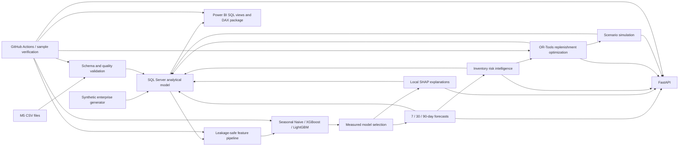

# Architecture

The platform is production-style and portfolio-grade, not production-ready. SQL Server
Express with Windows authentication is the primary local workflow. Container SQL Server
and SQL authentication are optional for CI and portable demonstrations.
