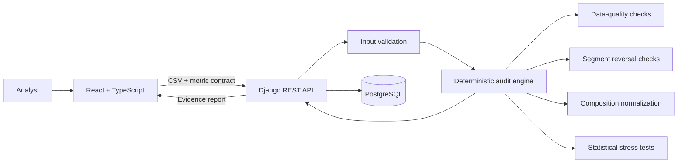

# Architecture

Metric Mirage is a modular full-stack application. Statistical calculations are deliberately isolated from presentation and natural-language concerns so every conclusion is reproducible.

## Boundaries

- **React application:** claim entry, uploads, interactive trends, evidence navigation, searchable session reviews, JSON evidence download and browser-printable reports. Review history lives in React state and is cleared on refresh.
- **Django API:** authentication, persistence, file limits, throttling and orchestration.
- **Audit engine:** pure dataframe-to-report transformation. It has no database or HTTP dependency and is directly unit tested.
- **PostgreSQL:** datasets, metric contracts and completed audit records created through the separate authenticated API. The current frontend does not use these persistent resources.
- **Nginx:** containerized frontend delivery and same-origin API proxying.

The frontend includes a saved sample response for API outages. It is labeled as a sample and supports interface exploration; new CSV analysis still requires the backend. There is no browser analytics engine, sign-in screen or frontend account history in this version.

## Request lifecycle

1. The analyst provides a claim and a metric contract: numerator, denominator, date and segments.
2. The frontend validates the CSV extension and size; the public API enforces the size limit and returns readable parsing errors.
3. Invalid dates, numeric values and denominator rows are measured and excluded from calculations.
4. The split date separates baseline and comparison periods.
5. The engine calculates raw and fixed-composition results.
6. Each check returns its status and explanation. Unsupported checks are marked `not_applicable`; findings contain severity, evidence and a recommended response.
7. An evidence score is calculated from fixed severity penalties. It is a review heuristic, not a probability.
8. The response includes a metric contract, actual observed date ranges, coverage and limitations. The React client renders it and exports the complete response as JSON; browser printing saves the shorter decision report.

## Persistence boundary

`POST /api/analyze/` is a synchronous, one-shot analysis endpoint and does not create dataset or audit database records. The authenticated dataset, metric and audit endpoints provide a separate persistence workflow. They currently require authentication but do not enforce per-owner queryset isolation; they must not be treated as isolated tenant workspaces.

## Scaling path

The current synchronous endpoint is intentional for portfolio-sized CSVs below 10 MB. For large workloads, place `analyze_dataframe` behind Celery workers, store uploads in object storage and stream status through polling or server-sent events. No analytical rewrite is required because the engine is already isolated.
